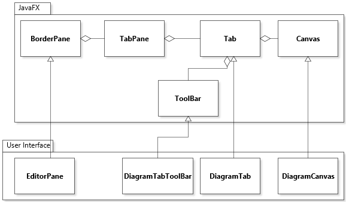

# Document Type: E
# Architecture of JetUML

JetUML is a medium-sized, pure-Java desktop application to create and edit diagrams in the Unified Modeling Language (UML). Diagrams in JetUML are created interactively, and can be saved in JSON, exported to popular image formats, and copied to the system clipboard for integration with other tools. JetUML currently supports Class diagrams, Sequence diagrams, State diagrams, Object diagrams, and Use Case diagrams. The application is built using the [JavaFX](https://docs.oracle.com/javase/8/javase-clienttechnologies.htm) graphical user interface (GUI) framework.

The Figure below shows how packages are organized in JetUML. 


In the figure, packages that logically belong together are clustered. Arrows represent compile-time dependencies between classes in different packages. The most important data structure in JetUML is the `Diagram`. A `Diagram` is an object structure that represents a UML diagram. There are different `Diagram` subclasses for different types of UML diagrams. A diagram is composed of nodes and edges. There are also different nodes and edge types that correspond to different nodes and edges in UML diagrams. Except for the position of each node, classes in the Diagram Model package do not have any responsibility for depicting how the diagram looks. This responsibility is handled by *views*. However, each node and edge holds a reference to a view object that matches its type. Similarly, diagrams hold a reference to a view object for the entire diagram. What this means is that to obtain the view object for, say, a node, we can do simply:

```
node.view();
```

The most important service provided by views is to draw whatever the view represents on a graphics context. Additional services include computing the bounding box from the diagram element, determining if it contains a point, etc. 

Geometry in JetUML is based entirely on integer coordinates. The package `geom` has application specific classes to represent most geometric primitives, such as points, lines, rectangles, etc. Originally, the project depended on geometric shapes classes supplied by the Java's original Abstract Windowing Toolkit (AWT) framework. These classes specified coordinates using floating-point numbers using the class `java.awt.Point`. We switched to the application-specific class around release 2.0 for two reasons. First, the floating-point geometry introduced all sorts of unnecessary inexact calculations. Second, by using AWT classes we were tied to this old framework because of the references to classes like `Point`. This was going to be a problem when switching to the more modern JavaFX. Now, all coordinates are stored in objects of framework-independent classes. Although this is not shown on the figure, all other modules depend on the `geom` package.

The classes that integrate with the JavaFX GUI framework to create the user interface are located in the User Interface module, which groups the `gui` and `application` packages. In addition to GUI classes, these also include helper classes such as a `Clipboard` class to copy and paste diagram elements. The GUI classes depend on a large Services module that can be conceptually separated into three sub-modules. The first module holds the view classes, as described above. The second module, called the Diagram Builder, holds all the classes that implement the logic required to build a diagram. This includes the business rules to determine what composition of nodes and edges are valid, but also the creation of a stack of commands for creating the diagram. Commands can then be created and undone. Diagram Builder also depends on the Views module. This is because to determine if, for example, adding a certain edge is legal, it is necessary to compute the geometry of the diagram. Finally, the GUI also depends on a Persistence module that holds the code necessary to serialize diagrams in JSON format and deserialize them.

The integration of the user-defined classes of JetUML, with the JavaFX framework relies on subclassing. The figure below shows how the user interface classes in JetUML relate to the framework classes. 



The diagram elements in the JavaFX package are the library classes and the ones in the User Interface package map to the User Interface module. The main window of the application is realized by class `EditorFrame`, which is a specialized version of a `BorderPane` that is added as the root of the UI's *scene*. In JavaFX terminology the scene is the top level element of the user interface, which contains a background and any number of GUI components placed in it. Most of the area of an `EditorFrame` is occupied by a `TabPane`, a GUI component that can hold zero or more *tabs* (overlapping windows). When a diagram is opened, menus of the `EditorFrame` create a `DiagramTab` to old the diagram. The `DiagramTab` instance is then added to the `EditorFrame's` tab pane. This is possible because `DiagramTab` is a subtype of `Tab`, the type of the objects aggregated by a `TabPane`. A `DiagramTab` contains two GUI components: a *toolbar* to hold buttons that correspond to the different "tools" for selecting and creating nodes and edges, and the *canvas*, where the diagram is drawn and can be manipulated. Similar to the `DiagramTab`, the toolbar and the canvas are integrated into the application by extending classes `ToolBar` and `Canvas`, which can be added as children of a `Tab`. In practice, this is done through a `BorderPane` and `ScrollPane` layout object, but this detail is not crucial and not shown in the figure.

The figure below shows how objects of the main classes mentioned above collaborate to respond to a user request to add a node. 


The event handler for a command to add a node is an invisible object of class `DiagramCanvasController`. The controller gets a node prototype from the toolbar and clones it to create the new node to add to the diagram. This node is then passed to a method of another non-GUI object, `DiagramBuilder`, to create an operation to create the node. The operation is then stored (not shown in the model) and executed. Executing the command triggers a call to `addRootNode` on the `Diagram` object. The sequence is completed by a call to `paintPanel` on the canvas, to refresh the drawing.


