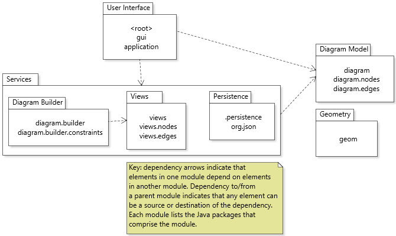
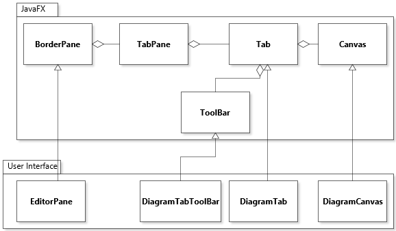
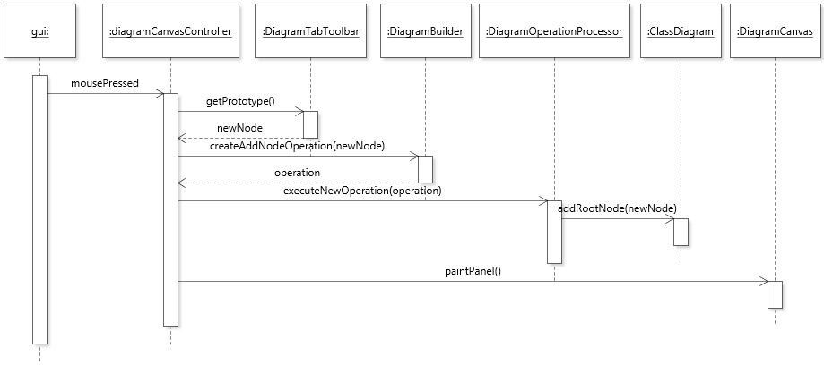

# Document Type: V                                          
# Architecture of JetUML

JetUML is a medium-sized, pure-Java desktop application to create and edit diagrams in the Unified Modeling Language (UML). Diagrams in JetUML are created interactively, and can be saved in JSON, exported to popular image formats, and copied to the system clipboard for integration with other tools. Currently supports Class diagrams, Sequence diagrams, State diagrams, Object diagrams, and Use case diagrams. The application is built using the [JavaFX](https://docs.oracle.com/javase/8/javase-clienttechnologies.htm) graphical user interface (GUI) framework.

## Module Uses View

This view captures the overall organization of the application in terms of modules. A module is a container for source code. In JetUML, a module corresponds to one package or one cluster of related packages.
The **relation** between modules is "A uses B" and is represented with a directed dependency edge from A to B. A uses relation means compilation units in module A need type declarations (classes or interfaces) in module B to be compilable. The **interfaces** of a module is defined as all the `public` type and element declarations in the module.

### Primary Presentation

### Element Catalog

* **User Interface** Includes main application launcher class, as well as the classes necessary to create the graphical user interface application. Responsibilities of classes and interfaces in this module include participation in the composition of the GUI scene graph, handling GUI-related tasks such as copying and pasting and managing user preferences, and responding to GUI events such as user selection of menus and interactions with graphical elements in a diagram.

* **Diagram Builder** Includes classes and interface that implement the business rules and support utilities for creating diagrams from user interactions. Specific responsibilities include storing, executing, and undoing commands to build a diagram, testing whether certain user interactions to create or modify a diagram are valid, and creating such commands.

* **Views** Includes all elements responsible for drawing the various elements of a diagram and computing various attributes of drawn elements (e.g., size, bounds). 

* **Persistence** Elements responsible for serializing and deserializing diagrams and saving/loading serialized diagrams to/from permanent storage.

* **Diagram Model** Elements responsible for maintaining a run-time representation of a diagram as a set of specialized nodes and edges.

* **Geometry** Classes to represent basic geometric elements (points, lines, rectangles) necessary for defining and viewing diagrams. Geometry in JetUML is based entirely on integer coordinates. All modules use the `Geometry` module (the uses relations not show in the primary presentation for clarity).

* **Services** The `Diagram Builder`, `Views`, and `Persistence` modules form a layer that is accessed by the user interface and accesses the `Diagram Model`.

### Rationale

* The `DiagramBuilder` module depends on `View` because to determine how to insert or remove nodes and edges based on user inputs, it is necessary to compute the visible location of diagram elements.
* The geometry module re-implements features available in Java. However, in Java geometric primitives are defined part of a graphical user interface framework (e.g., [Point](https://docs.oracle.com/javase/8/docs/api/index.html?java/awt/Point.html)). The module provides framework-independent support for geometric shapes, and uses integer geometry instead of floating-point numbers. This avoids all sorts of unnecessary inexact calculations.

## Generalization View

This view captures how modules of the application integrate the JavaFX framework. The **relation** *between modules* is "A extends B" and is represented with a generalization edge from A to B. A extends B means A is a subclass of B. The relations between elements *within a module* is "A aggreates B" and is represented with an aggregation edge from A to B (the diamond is placed on the "A" side). A aggregates B means that an instance of class A stores a reference to an instance of class B. The **interfaces** involved in generalizations are the `public` and `protected` members of the class that is being generalized (class B). The **interfaces** involved in generalizations are the non-`private` members of the class that is being aggregated (class B). 

### Primary Presentation

### Element Catalog

* **EditorPane** Represents the main (outer) application window, with menus (not modeled) and tabs that can manage different opened diagrams. The `EditorPane` extends [BorderPane](https://docs.oracle.com/javase/8/javafx/api/javafx/scene/layout/BorderPane.html).
* **DiagramTab** Represents one tab that manages a single open diagram. The `DiagramTab` extends [Tab](https://docs.oracle.com/javase/8/javafx/api/javafx/scene/control/Tab.html). This element aggregates a `DiagramTabToolBar` and a `DiagramCanvas` through a `BoderPane` stored in its parent `Tab` (this detail is not shown).  
* **DiagramTabToolBar** Represents the user interface component that collects the different "tools" that a user can select to create and modify a diagram (e.g., to add nodes and edges). The `DiagramTabToolBar` extends [ToolBar](https://docs.oracle.com/javase/8/javafx/api/javafx/scene/control/ToolBar.html).
* **DiagramCanvas** A canvas is a user interface component upon which is it possible to draw shapes. In JetUML, diagrams are drawn on a Canvas. The `DiagramCanvas` extends [Canvas](https://docs.oracle.com/javase/8/javafx/api/javafx/scene/canvas/Canvas.html).

### Element Behavior

This diagram captures how the application responds to user input events.

### Rationale

The user interface elements extend elements in the JavaFX framework both to reuse their functionality and to make them compatible to be integrated into a JavaFX scene graph.

